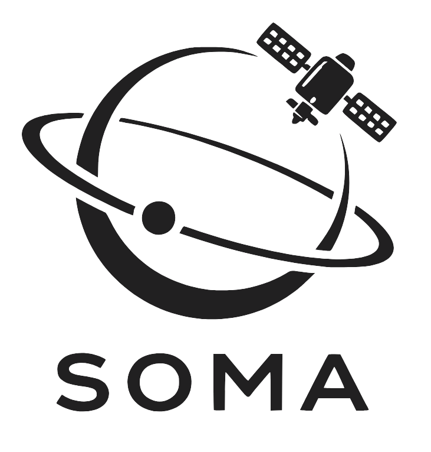

# SOMA – Satellite Orbit Monitoring Application

  
  
  
  
  

  

**Sieh in Echtzeit, wo Satelliten gerade über dich hinwegfliegen.**

SOMA ist eine Web-Anwendung, die Satelliten live auf einer dunklen Weltkarte zeigt – inklusive ihres Flugwegs der letzten 90 Minuten. Öffne die Seite im Browser, und du siehst sofort die Internationale Raumstation (ISS), wie sie mit rund 28.000 km/h um die Erde kreist. Über eine Suchleiste kannst du weitere Satelliten hinzufügen – zum Beispiel das Hubble-Weltraumteleskop, Starlink-Satelliten oder jeden anderen der rund 11.000 aktiven Objekte im Erdorbit.

## Was SOMA besonders macht

- **Läuft komplett im Browser.** Keine Registrierung, keine Installation, keine Server. Alle Berechnungen passieren lokal auf deinem Gerät.
- **Offline-fähig.** Einmal geladen, funktioniert SOMA auch ohne Internetverbindung weiter – mit den zuletzt bekannten Daten.
- **Keine Tracker, keine Cookies.** Deine Daten verlassen den Browser nicht.
- **Ästhetik statt Datenflut.** SOMA zeigt wenige Satelliten schön, statt tausende gleichzeitig zu überladen. Der Fokus liegt auf Beobachtung, nicht auf Analyse.

## Wie funktioniert das überhaupt?

Ein Satellit fliegt nicht zufällig durch den Weltraum – seine Bahn folgt den Gesetzen der Himmelsmechanik und lässt sich aus wenigen Zahlen berechnen. Diese Zahlen nennt man **Bahnelemente**: Höhe, Neigung, Geschwindigkeit, aktuelle Position zu einem bestimmten Zeitpunkt. Wer sie kennt, kann ausrechnen, wo der Satellit in einer Sekunde, einer Minute oder einer Stunde sein wird.

SOMA lädt diese Bahnelemente vom **CelesTrak**-Katalog – einem öffentlichen, seit Jahrzehnten etablierten Dienst, der Daten des US-Raumüberwachungsnetzwerks aufbereitet. Ein im Browser laufender Algorithmus (SGP4) verwandelt diese Zahlen in Echtzeit-Positionen, die auf der Karte dargestellt werden.

### TLE und OMM – kurz erklärt

Die Bahnelemente werden in standardisierten Formaten ausgetauscht:

- **TLE (Two-Line Element Set)** ist das klassische Format aus den 1960er-Jahren: zwei Zeilen Text mit festen Spaltenpositionen. Es ist kompakt, aber schwer zu lesen und stößt heute an Grenzen – etwa bei der Zahl möglicher Satelliten-IDs.
- **OMM (Orbit Mean-Elements Message)** ist der moderne Nachfolger, standardisiert vom internationalen Raumfahrt-Gremium CCSDS. OMM ist im JSON-Format, gut lesbar, erweiterbar und zukunftssicher. CelesTrak stellt beide Formate bereit, migriert aber aktiv auf OMM.

SOMA nutzt ausschließlich OMM. Für dich als Nutzer macht das keinen Unterschied – aber es bedeutet, dass SOMA auch dann noch funktioniert, wenn TLE eines Tages abgelöst wird.

## Was du in SOMA tun kannst

- Die ISS beim Umkreisen der Erde beobachten (beim ersten Öffnen automatisch sichtbar).
- Satelliten nach Name oder NORAD-ID suchen – etwa „Hubble" oder „25544".
- Mehrere Satelliten gleichzeitig verfolgen.
- Auf einen Satelliten klicken und Live-Daten sehen: Koordinaten, Höhe über der Erde, Geschwindigkeit.
- Den Ground Track ansehen – also die Linie auf der Erdoberfläche, über die der Satellit in den letzten 90 Minuten hinweggeflogen ist. Geostationäre Satelliten, die sich mit der Erde mitdrehen, werden als fester Punkt dargestellt.

## Für wen ist SOMA gedacht?

SOMA richtet sich an Raumfahrt-Interessierte, Lehrende, Schüler und alle, die einfach neugierig sind, was gerade über ihren Köpfen passiert. Es ist kein Werkzeug für professionelle Bahnverfolgung oder Kollisionsanalyse – dafür gibt es spezialisierte Software. SOMA will das Erlebnis bieten, dem unsichtbaren Verkehr im Orbit zuzusehen.

## Technischer Hintergrund (Kurzfassung)

SOMA ist eine Progressive Web App, gebaut mit React, TypeScript und MapLibre GL JS. Orbit-Berechnungen laufen in einem Web Worker, damit die Oberfläche auch bei vielen Satelliten flüssig bleibt. Als Datenquelle dient CelesTrak. Die Karte basiert auf dem frei verfügbaren CARTO Dark Matter Style.

## Quellen & Weiterführendes

- [CelesTrak](https://celestrak.org) – Datenquelle für Bahnelemente
- [OMM-Standard (CCSDS 502.0-B)](https://public.ccsds.org) – das moderne Format
- [satellite.js](https://github.com/shashwatak/satellite-js) – die Bibliothek hinter den Berechnungen
- [MapLibre GL JS](https://maplibre.org) – die Kartentechnologie
